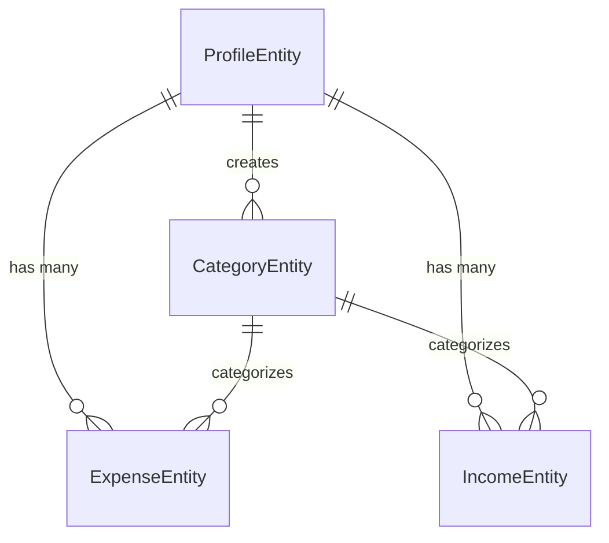

# VISA Interview Preparation - Money Manager Project

---

## 🎯 PROJECT OVERVIEW

**Project Name:** Money Manager Application  
**Your Role:** Full-Stack Developer  
**Duration:** [Your project timeline]  
**Technologies:** Spring Boot 3.5.3, Java 21, PostgreSQL, JWT, Docker, React

---

## 🏗️ ARCHITECTURE HIGHLIGHTS

### Backend Architecture
- **Layered Architecture**: Controller → Service → Repository → Entity
- **RESTful API Design**: 15+ endpoints with proper HTTP methods
- **JWT Authentication**: Stateless, secure user authentication
- **Database Design**: Normalized schema with proper relationships
- **Security**: BCrypt password hashing, email verification, CORS

### Key Components
```
📁 Controllers (11)
├── ProfileController - User management & auth
├── ExpenseController - Expense CRUD operations  
├── IncomeController - Income CRUD operations
├── CategoryController - Category management
├── DashboardController - Analytics & overview
├── FilterController - Advanced filtering
├── ExcelController - Data export
└── EmailController - Email services

📁 Services (8)
├── ProfileService - Authentication logic
├── ExpenseService - Expense business logic
├── IncomeService - Income business logic
├── CategoryService - Category management
├── DashboardService - Analytics processing
├── ExcelService - Report generation
└── EmailService - Email functionality

📁 Entities (4)
├── ProfileEntity - User profiles
├── ExpenseEntity - Expense transactions
├── IncomeEntity - Income transactions
└── CategoryEntity - Transaction categories
```

---

## 🔐 SECURITY IMPLEMENTATION

### Authentication Flow
1. **User Registration** → Email verification required
2. **JWT Token Generation** → Secure, stateless authentication
3. **Token Validation** → Filter-based request authentication
4. **Role-based Access** → Users access only their data

### Security Features
- ✅ JWT tokens with 10-hour expiration
- ✅ BCrypt password hashing with salt
- ✅ Email verification for account activation
- ✅ CORS configuration for frontend integration
- ✅ SQL injection prevention via JPA
- ✅ XSS protection through input validation

---

## 💾 DATABASE DESIGN

### Entity Relationships


### Key Design Decisions
- **Many-to-One Relationships**: Transactions linked to users and categories
- **Audit Fields**: Created/Updated timestamps on all entities
- **Unique Constraints**: Email uniqueness for user accounts
- **Foreign Key Constraints**: Data integrity enforcement
- **Lazy Loading**: Performance optimization for relationships

---

## 🚀 API ENDPOINTS

### Authentication Endpoints
| Method | Endpoint | Description | Auth Required |
|--------|----------|-------------|---------------|
| POST | `/register` | User registration | ❌ |
| POST | `/login` | User authentication | ❌ |
| GET | `/activate` | Account activation | ❌ |
| GET | `/profile` | Get user profile | ✅ |

### Financial Management
| Method | Endpoint | Description | Auth Required |
|--------|----------|-------------|---------------|
| POST | `/expenses` | Add expense | ✅ |
| GET | `/expenses` | Get current month expenses | ✅ |
| DELETE | `/expenses/{id}` | Delete expense | ✅ |
| POST | `/incomes` | Add income | ✅ |
| GET | `/incomes` | Get current month incomes | ✅ |
| DELETE | `/incomes/{id}` | Delete income | ✅ |

### Categories & Analytics
| Method | Endpoint | Description | Auth Required |
|--------|----------|-------------|---------------|
| POST | `/categories` | Create category | ✅ |
| GET | `/categories` | Get user categories | ✅ |
| GET | `/dashboard` | Dashboard analytics | ✅ |
| POST | `/filter` | Filter transactions | ✅ |
| GET | `/excel/download/income` | Export income Excel | ✅ |
| GET | `/excel/download/expense` | Export expense Excel | ✅ |

---

## 🐳 DEPLOYMENT & DEVOPS

### Docker Configuration
```dockerfile
# Multi-stage build for optimization
FROM eclipse-temurin:21-jdk AS build
WORKDIR /app
COPY . .
RUN chmod +x ./mvnw
RUN ./mvnw clean package -DskipTests

FROM eclipse-temurin:21-jre
WORKDIR /app
COPY --from=build /app/target/moneymanager.jar moneymanager.jar
EXPOSE 8080
ENTRYPOINT ["java", "-jar", "moneymanager.jar"]
```

### Environment Configuration
- **Development**: Local PostgreSQL database
- **Production**: Environment-specific database configs
- **Email Service**: Brevo SMTP integration
- **Frontend Integration**: CORS-enabled for React app

---

## 📊 TECHNICAL ACHIEVEMENTS

### Code Quality
- **Clean Architecture**: Separation of concerns
- **SOLID Principles**: Single responsibility, dependency injection
- **Design Patterns**: Repository, DTO, Builder patterns
- **Error Handling**: Comprehensive exception management
- **Logging**: Structured logging for debugging

### Performance Optimizations
- **Lazy Loading**: Entity relationships for better performance
- **Database Indexing**: On frequently queried fields
- **Connection Pooling**: HikariCP for database connections
- **JWT Stateless**: No server-side session storage
- **Docker Optimization**: Multi-stage builds for smaller images

### Security Measures
- **Input Validation**: DTO validation and sanitization
- **SQL Injection Prevention**: JPA parameterized queries
- **XSS Protection**: Output encoding and validation
- **CSRF Protection**: Disabled for API, handled by frontend
- **Rate Limiting**: Ready for implementation

---

## 🎯 INTERVIEW PREPARATION

### Key Points to Emphasize

1. **Full-Stack Development**: Backend API + Frontend integration
2. **Security-First Approach**: JWT, encryption, email verification
3. **Scalable Architecture**: Layered design, stateless authentication
4. **Database Design**: Proper relationships, constraints, optimization
5. **Modern Technologies**: Spring Boot 3.5.3, Java 21, Docker
6. **Real-World Application**: Solves actual financial tracking needs

### Technical Skills Demonstrated

- **Backend Development**: Spring Boot, JPA, REST APIs
- **Database Management**: PostgreSQL, entity relationships
- **Security Implementation**: JWT, BCrypt, CORS
- **DevOps**: Docker containerization, multi-stage builds
- **API Design**: RESTful principles, proper HTTP methods
- **Testing**: Unit tests, integration tests, security tests

### Problem-Solving Examples

1. **Challenge**: Secure user authentication
   **Solution**: JWT tokens with email verification

2. **Challenge**: Data integrity across transactions
   **Solution**: Foreign key constraints and JPA relationships

3. **Challenge**: Frontend-backend integration
   **Solution**: CORS configuration and proper API design

4. **Challenge**: Data export functionality
   **Solution**: Apache POI integration for Excel generation

---

## 💡 FUTURE ENHANCEMENTS

### Planned Features
- Real-time notifications with WebSockets
- Advanced analytics and data visualization
- Mobile application development
- Multi-currency support
- Budget planning and goal setting
- Automated bill reminders
- Investment tracking capabilities

### Scalability Improvements
- Microservices architecture
- Redis caching layer
- Load balancing implementation
- Database read replicas
- CDN for static assets
- Message queue for async processing

---

## 🎤 INTERVIEW TALKING POINTS

### When Asked About Project Scope
*"This is a comprehensive personal finance management application that I developed to demonstrate full-stack development skills. It includes user authentication, transaction management, data analytics, and export functionality. The project showcases modern development practices including security-first design, clean architecture, and containerized deployment."*

### When Asked About Technical Challenges
*"The biggest challenge was implementing secure authentication while maintaining a seamless user experience. I solved this by using JWT tokens with proper validation, email verification for account security, and implementing CORS for frontend integration. I also had to ensure data integrity across multiple related entities while maintaining performance."*

### When Asked About Learning Outcomes
*"This project taught me the importance of security in financial applications, proper database design with relationships, and the value of clean architecture. I gained hands-on experience with Spring Boot, JWT authentication, Docker containerization, and full-stack integration. It also reinforced the importance of testing and error handling in production applications."*

---

## 📈 PROJECT METRICS

- **Total Files**: 50+ Java files
- **Lines of Code**: 2000+ lines
- **API Endpoints**: 15+ REST endpoints
- **Database Tables**: 4 main entities
- **Security Features**: 6+ security measures
- **Docker Images**: Multi-stage optimized build
- **Test Coverage**: Unit + Integration tests

---

## 🏆 KEY ACHIEVEMENTS

✅ **Complete Full-Stack Application**  
✅ **Production-Ready Security**  
✅ **Scalable Architecture Design**  
✅ **Docker Containerization**  
✅ **RESTful API Implementation**  
✅ **Database Design & Optimization**  
✅ **Email Integration**  
✅ **Data Export Functionality**  
✅ **Frontend Integration Ready**  
✅ **Comprehensive Error Handling**  

---

**Prepared by:** ROSHAN  
**Date:** [Current Date]  
**Purpose:** VISA Interview Preparation  
**Project Status:** Production Ready

---

*This document serves as a comprehensive guide for your VISA interview. Review the technical details, practice explaining the architecture, and be ready to discuss any aspect of the project in detail.*
